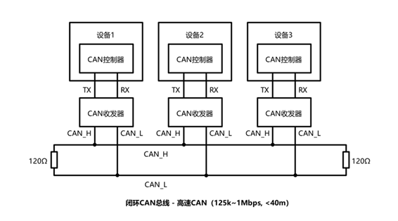
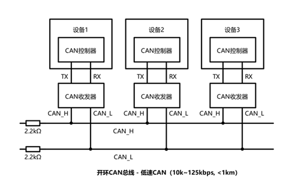
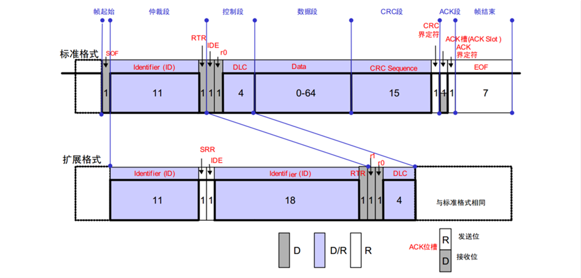
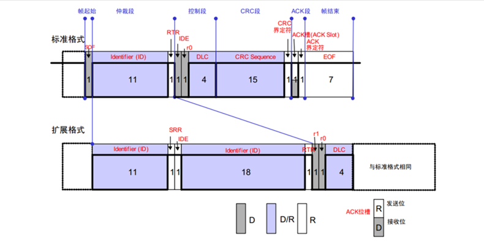
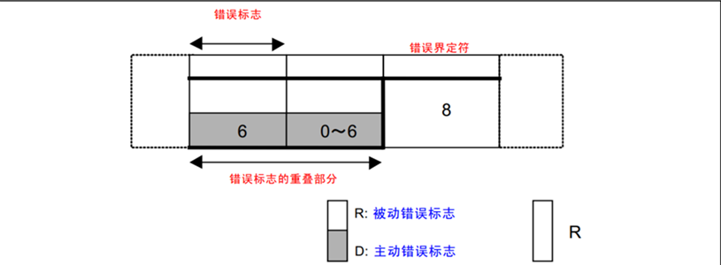
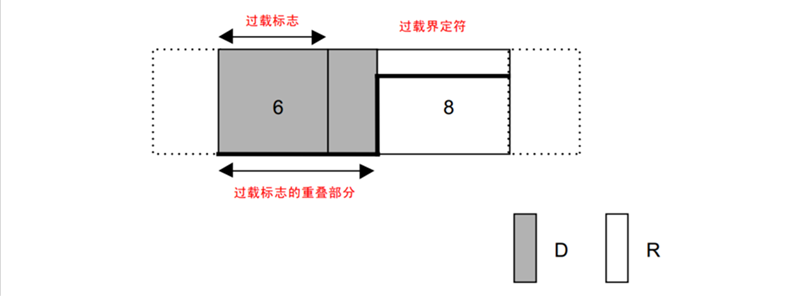
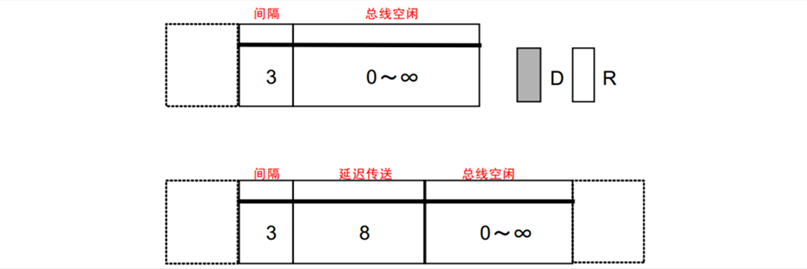

CAN总线
============================
## 一、简介
- CAN总线(Controller Area Network Bus)，全称控制局域网总线。  
- CAN总线由BOSCH公司研发的一种**简洁易用**、**传输速度快**、**易扩展**、**可靠性高**的**串行**通讯协议总线。  

### 1. CAN总线特征
- **差分线**传输，**抗干扰能力强**  
- 两根通信线(CAN_H,CAN_L)，**无需共地**  
- 高速CAN(ISO11898): 125k~1Mbps, <40m  
- 低速CAN(ISO11519): 10k~125kbps, <1km  
- **异步**，通讯**无需**时钟线，需要约定通讯速率  
- **半双工**，支持**多设备**，通过总线仲裁判断顺序  
- 11/29位报文ID(标准/扩展),区分消息，决定优先级  
- 可配置至多8字节的有效载荷  
- 可实现**广播式**和**请求式**两种传输方式  
- 应答，CRC校验，位填充，位同步，错误处理等特性

### 2. CAN硬件电路
- CAN设备通过CAN收发器挂载在CAN总线上
- CAN控制器CAN控制器引出的TX和RX与CAN收发器相连，CAN收发器引出的CAN_H和CAN_L分别与总线的CAN_H和CAN_L相连
- 高速CAN使用闭环网络，CAN_H和CAN_L两端添加120Ω的终端电阻
- 低速CAN使用开环网络，CAN_H和CAN_L其中一端添加2.2kΩ的终端电阻


### 3. CAN电平标准
#### (1)高速CAN
- 电压差为0时代表逻辑1(隐性电平) （无操作时被电阻拉至等电位）    
- 电压差为2V时表示逻辑0(显性电平) （设备主动制造差分型号）
#### (2)低速CAN
- 电压差为-1.5V时代表逻辑1(隐性电平)
- 电压差为3V时表示逻辑0(显性电平)


## 二、帧格式
  - CAN协议规定了5种类型的帧，分别为
    - 数据帧：发送设备主动发送数据(广播式)
    - 遥控帧：接受设备主动请求数据(请求式)
    - 错误帧：设备检测出错误向其他设备通知
    - 过载帧：接受设备尚未做好接受准备
    - 帧间隔：用于隔开数据帧，遥控帧与其他帧

### 1. 数据帧


### 2. 遥控帧
- 遥控帧无数据段，RTR为隐性电平1，其他部分与数据帧相同


### 3. 错误帧
- 总线上所有设备都会监督总线的数据，一旦发现“位错误”或“填充错误”或“CRC错误”或“格式错误”或“应答错误” ，这些设备便会发出错误帧来破坏数据，同时终止当前的发送设备


### 4. 过载帧
- 当接收方收到大量数据而无法处理时，其可以发出过载帧，延缓发送方的数据发送，以平衡总线负载，避免数据丢失


### 5. 帧间隔
- 将数据帧和遥控帧与前面的帧分离开


### 6. 位填充
- 发送方每发送5个相同电平，自动追加一个相反电平的填充位，接收方检测到填充位时，自动移除恢复原始数据
- 作用
  - 增加波形定时信息，利于接收方"再同步"，防止波形长时间无变化，不能精确掌握采样时机
  - 将正常数据流与错误、过载帧隔开，标志错误、过载帧的特异性
  - 保持CAN总线在发送正常数据流的活跃状态，防止被误认为总线空闲


## STM32CAN外设
### 1. 简介
- STM32内置bxCAN外设(CAN控制器)，支持CAN2.0A和2.0B,可以自动发送CAN报文和按照过滤器自动接收指定CAN报文，程序只需要处理报文数据而无需关注总线的电平细节
- 波特率最高可到达**1Mbps**
- 3个可配置优先级的发送邮箱
- 2个3级深度的接受FIFO Filter(先入先出过滤器)
- 14个过滤器组(互联型28个)
- 事件触发通信、自动离线恢复、自动唤醒、禁止自动重传、接收FIFO溢出处理方式可配置、发送优先级可配置、双CAN模式

## FIFO过滤器的配置

#### 其函数原型如下
```C
HAL_StatusTypeDef HAL_CAN_ConfigFilter(CAN_HandleTypeDef *hcan,
 const CAN_FilterTypeDef *sFilterConfig)
```

- 其中结构体`CAN_FilterTypeDef`定义如下
```C
    typedef struct
    {
    uint32_t FilterIdHigh;  //CAN过滤器的高16位标识符
    uint32_t FilterIdLow;   //CAN过滤器的低16位标识符
    uint32_t FilterMaskIdHigh;  //设置CAN过滤器高16位掩码
    uint32_t FilterMaskIdLow;   //设置CAN过滤器低16位掩码      
    uint32_t FilterFIFOAssignment;  //使用哪个过滤器
    uint32_t FilterBank;    //过滤器编号
    uint32_t FilterMode;    //过滤器模式
    uint32_t FilterScale;   //过滤器宽度
    uint32_t FilterActivation;  //是否启用过滤器
    uint32_t SlaveStartFilterBank;  //给CAN2的起始过滤器编号
    } CAN_FilterTypeDef;
```
  - 其中`FilterFIFOAssignment`选择报文匹配哪个FIFO，可选值：`CAN_RX_FIFO0`和`CAN_RX_FIFO1`，分别代表FIFO0和FIFO1

  - 其中`FilterMode`有两个可选值，`CAN_FILTERMODE_IDMASK`和`CAN_FILTERMODE_IDLIST`，分别表示掩码模式和列表模式
  - 掩码模式：通过筛选ID特定位判断报文的接受与丢弃。**1位强制匹配，0位忽略**
  - 列表模式：列出ID，如果一致则接受，反之舍弃。
  - `FilterScale`决定列表中ID数，如果为32位，每个过滤器可写入两个ID，若为16位，每个过滤器可写入4个ID

  - 其中`FilterScale`有两个可选值，`CAN_FILTERSCALE_16BIT`和`CAN_FILTERSCALE_32BIT`，分别对应16位宽度和32位宽度，如果是扩展报文ID，**必须**选用32位

  - 其中`FilterActivation`有两个可选值，`CAN_FILTER_ENABLE`和`CAN_FILTER_DISABLE`，分别表示启动和关闭

  - 其中`SlaveStartFilterBank`应0-28的一个整数，用作第二过滤器的起始位
  
  - 一个配置示例
  ```C
  void bsp_can_filter_config(CAN_HandleTypeDef *canHandle)
  {
    CAN_FilterTypeDef filter = {0};
    filter.FilterActivation = ENABLE; //使能过滤器
    filter.FilterMode = CAN_FILTERMODE_IDMASK;    //使用掩码模式
    filter.FilterScale = CAN_FILTERSCALE_16BIT;   //16位宽度
    filter.FilterBank = 0;    //使用0号过滤器
    filter.FilterFIFOAssignment = CAN_RX_FIFO0;   //使用FIFO0
    filter.FilterIdLow = 0;   
    filter.FilterIdHigh = 0;
    filter.FilterMaskIdLow = 0;
    filter.FilterMaskIdHigh = 0;  //四项均为0，
    HAL_CAN_ConfigFilter(canHandle, &filter);
  }
  ```

## CAN发送
在HAL库中，CAN发送通过`HAL_CAN_AddTxMessage()`函数完成  

其函数原型如下
```C
HAL_StatusTypeDef HAL_CAN_AddTxMessage(
    CAN_HandleTypeDef *hcan,  // CAN 控制器句柄
    const CAN_TxHeaderTypeDef *pHeader, // 消息头配置结构体
    const uint8_t aData[],  // 数据缓冲区（最多8字节）
    uint32_t *pTxMailbox  // 返回使用的发送邮箱编号
    );
```
- `CAN_TxHeaderTypeDef`是消息头配置结构体，其定义如下
```C
typedef struct
{
  uint32_t StdId;   //标准ID
  uint32_t ExtId;   //扩展ID
  uint32_t IDE;     //决定使用标准ID或扩展ID
  uint32_t RTR;     //远程传输请求位
  uint32_t DLC;     //aData的长度(字节)
  FunctionalState TransmitGlobalTime; //时间触发通信模式使能位(仅用于高精度时间同步场景，一般DISABLE)
} CAN_TxHeaderTypeDef;
```
  - 其中`IDE`选择消息头使用哪种ID格式，可选值：`CAN_ID_STD`和`CAN_ID_EXT`，分别代表标准帧和扩展帧

  - 其中`RTR`有两个可选值，`CAN_RTR_DATA`和`CAN_RTR_REMOTE`，分别表示数据帧和遥控帧

  - 列表模式：列出ID，如果一致则接受，反之舍弃。
  - `FilterScale`决定列表中ID数，如果为32位，每个过滤器可写入两个ID，若为16位，每个过滤器可写入4个ID

  - 其中`FilterScale`有两个可选值，`CAN_FILTERSCALE_16BIT`和`CAN_FILTERSCALE_32BIT`，分别对应16位宽度和32位宽度，如果是扩展报文ID，**必须**选用32位

  - 其中`FilterActivation`有两个可选值，`CAN_FILTER_ENABLE`和`CAN_FILTER_DISABLE`，分别表示启动和关闭

  - 其中`SlaveStartFilterBank`应0-28的一个整数，用作第二过滤器的起始位
  
  - 一个配置示例
  ```C
  void bsp_can_send_msg(CAN_HandleTypeDef* canHandle,
                uint32_t id, uint8_t* data,
                uint32_t data_len) {
    uint32_t* msg_box;
    CAN_TxHeaderTypeDef send_msg_hdr;
    send_msg_hdr.StdId = id;
    send_msg_hdr.IDE = CAN_ID_STD;
    send_msg_hdr.RTR = CAN_RTR_DATA;
    send_msg_hdr.DLC = data_len;
    send_msg_hdr.TransmitGlobalTime = DISABLE;

    if (canHandle->Instance == CAN1) {
      HAL_CAN_AddTxMessage(&hcan1, &send_msg_hdr, data, msg_box);
    }
    if (canHandle->Instance == CAN2) {
      HAL_CAN_AddTxMessage(&hcan2, &send_msg_hdr, data, msg_box);
    }
}
  ```

## CAN接收
一般通过中断接受，在HAL库中，通过重定义中断回调函数`HAL_CAN_RxFifo0MsgPendingCallback()`函数完成CAN的接收
其函数原型如下  
```C
__weak void HAL_CAN_RxFifo0MsgPendingCallback(CAN_HandleTypeDef *hcan);
```