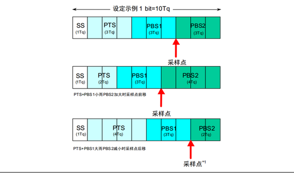
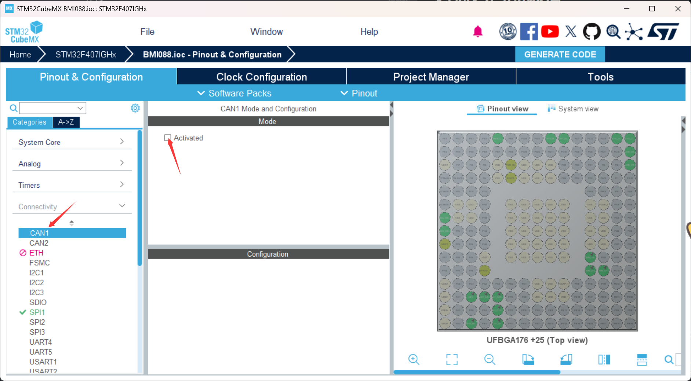
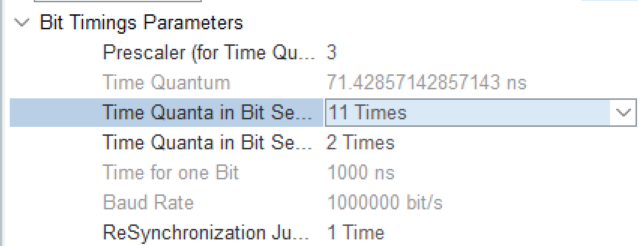
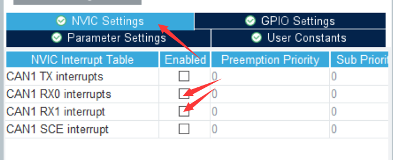

# CAN 总线

## 一、简介

- CAN 总线(Controller Area Network Bus)，全称控制局域网总线。
- CAN 总线由 BOSCH 公司研发的一种**简洁易用**、**传输速度快**、**易扩展**、**可靠性高**的**串行**通讯协议总线。

### 1. CAN 总线特征

- **差分线**传输，**抗干扰能力强**
- 两根通信线(CAN_H,CAN_L)，**无需共地**
- 高速 CAN(ISO11898): 125k~1Mbps, <40m
- 低速 CAN(ISO11519): 10k~125kbps, <1km
- **异步**，通讯**无需**时钟线，**需要**约定通讯速率
- **半双工**，支持**多设备**，通过总线仲裁判断顺序
- 11/29 位报文 ID(标准/扩展),区分消息，决定优先级
- 可配置至多 8 字节的有效载荷
- 可实现**广播式**和**请求式**两种传输方式
- 应答，CRC 校验，位填充，位同步，错误处理等特性

### 2. CAN 硬件电路

- CAN 设备通过 CAN 收发器挂载在 CAN 总线上
- CAN 控制器 CAN 控制器引出的 TX 和 RX 与 CAN 收发器相连，CAN 收发器引出的 CAN_H 和 CAN_L 分别与总线的 CAN_H 和 CAN_L 相连
- 高速 CAN 使用闭环网络，CAN_H 和 CAN_L 两端添加 120Ω 的终端电阻
- 低速 CAN 使用开环网络，CAN_H 和 CAN_L 其中一端添加 2.2kΩ 的终端电阻

### 3. CAN 电平标准

#### (1)高速 CAN

- 电压差为 0 时代表逻辑 1(隐性电平) （无操作时被电阻拉至等电位）
- 电压差为 2V 时表示逻辑 0(显性电平) （设备主动制造差分型号）

#### (2)低速 CAN

- 电压差为-1.5V 时代表逻辑 1(隐性电平)
- 电压差为 3V 时表示逻辑 0(显性电平)

## 二、帧格式

- CAN 协议规定了 5 种类型的帧，分别为
  - 数据帧：发送设备主动发送数据(广播式)
  - 遥控帧：接受设备主动请求数据(请求式)
  - 错误帧：设备检测出错误向其他设备通知
  - 过载帧：接受设备尚未做好接受准备
  - 帧间隔：用于隔开数据帧，遥控帧与其他帧

### 1. 数据帧


### 2. 遥控帧

- 遥控帧无数据段，RTR 为隐性电平 1，其他部分与数据帧相同
  

### 3. 错误帧

- 总线上所有设备都会监督总线的数据，一旦发现“位错误”或“填充错误”或“CRC 错误”或“格式错误”或“应答错误” ，这些设备便会发出错误帧来破坏数据，同时终止当前的发送设备
  

### 4. 过载帧

- 当接收方收到大量数据而无法处理时，其可以发出过载帧，延缓发送方的数据发送，以平衡总线负载，避免数据丢失
  

### 5. 帧间隔

- 将数据帧和遥控帧与前面的帧分离开
  

### 6. 位填充

- 发送方每发送 5 个相同电平，自动追加一个相反电平的填充位，接收方检测到填充位时，自动移除恢复原始数据
- 作用
  - 增加波形定时信息，利于接收方"再同步"，防止波形长时间无变化，不能精确掌握采样时机
  - 将正常数据流与错误、过载帧隔开，标志错误、过载帧的特异性
  - 保持 CAN 总线在发送正常数据流的活跃状态，防止被误认为总线空闲

## 三、采样

### 1. 问题

- 当接收方以约定时长进行采样但采样点未对齐中心时，误差会随时间增加而积累，采样点逐渐偏离，产生错误

### 2. 解决方案

- CAN 协议划分了每个数据位的时长分为同步段（SS）、传播时间段（PTS）、相位缓冲段 1（PBS1）和相位缓冲段 2（PBS2），每个段又由若干个最小时间单位（Tq）构成
- 硬同步
  - 每个设备都有一个位时序计时周期，当某个设备（发送方）率先发送报文，其他所有设备（接收方）收到 SOF 的下降沿时，接收方会将自己的位时序计时周期拨到 SS 段的位置，与发送方的位时序计时周期保持同步
  - 硬同步只在帧的第一个下降沿（SOF 下降沿）有效
  - 经过硬同步后，若发送方和接收方的时钟没有误差，则后续所有数据位的采样点必然都会对齐数据位中心附近
- 再同步
  - 若发送方或接收方的时钟有误差，随着误差积累，数据位边沿逐渐偏离 SS 段，则此时接收方根据再同步补偿宽度值（SJW）通过加长 PBS1 段，或缩短 PBS2 段，以调整同步
  - 再同步可以发生在第一个下降沿之后的每个数据位跳变边沿

## 四、多设备问题

### 1. 先占先得

- 若当前已经有设备正在操作总线发送数据帧/遥控帧，则其他任何设备不能再同时发送数据帧/遥控帧（可以发送错误帧/过载帧破坏当前数据）
- 任何设备检测到连续 11 个隐性电平，即认为总线空闲，只有在总线空闲时，设备才能发送数据帧/遥控帧
- 一旦有设备正在发送数据帧/遥控帧，总线就会变为活跃状态，必然不会出现连续 11 个隐性电平，其他设备自然也不会破坏当前发送
- 若总线活跃状态其他设备有发送需求，则需要等待总线变为空闲，才能执行发送需求

### 2. 非破坏性仲裁

- 若多个设备的发送需求同时到来或因等待而同时到来，则 CAN 总线协议会根据 ID 号（仲裁段）进行非破坏性仲裁，ID 号小的（优先级高）取到总线控制权，ID 号大的（优先级低）仲裁失利后将转入接收状态，等待下一次总线空闲时再尝试发送
- 实现非破坏性仲裁需要两个要求：
  - 线与特性：总线上任何一个设备发送显性电平 0 时，总线就会呈现显性电平 0 状态，只有当所有设备都发送隐性电平 1 时，总线才呈现隐性电平 1 状态，即：0 & X & X = 0，1 & 1 & 1 = 1
  - 回读机制：每个设备发出一个数据位后，都会读回总线当前的电平状态，以确认自己发出的电平是否被真实地发送出去了，根据线与特性，发出 0 读回必然是 0，发出 1 读回不一定是 1

# STM32CAN 外设

### 简介

- STM32 内置 bxCAN 外设(CAN 控制器)，支持 CAN2.0A 和 2.0B,可以自动发送 CAN 报文和按照过滤器自动接收指定 CAN 报文，程序只需要处理报文数据而无需关注总线的电平细节
- 波特率最高可到达**1Mbps**
- 3 个可配置优先级的发送邮箱
- 2 个 3 级深度的接受 FIFO Filter(先入先出过滤器)
- 14 个过滤器组(互联型 28 个)
- 事件触发通信、自动离线恢复、自动唤醒、禁止自动重传、接收 FIFO 溢出处理方式可配置、发送优先级可配置、双 CAN 模式

## CAN 外设在 Stm32CubeMx 中的配置

#### 使能 CAN 外设



#### 配置 CAN 外设



- **CAN 总线通讯频率计算公式：**  
   **CAN 波特率=APB 总线频率/分频系数/（TBS1+TBS2+SS）**  
   在 Stm32 中，CAN1，CAN2 均挂载在 APB1 上，TBS1，TBS2 为图中两个 Time Quanta，SS 在 Stm32 固定为 1

#### 使能 CAN 外设的接受中断



- RX0 表示使用 FIFO0，RX1 表示使用 FIFO1

## FIFO 过滤器的配置

#### 在 HAL 库中，过滤器通过`HAL_CAN_ConfigFilter()`函数配置

#### 其函数原型如下

```C
HAL_StatusTypeDef HAL_CAN_ConfigFilter(CAN_HandleTypeDef *hcan,
 const CAN_FilterTypeDef *sFilterConfig)
```

- 其中结构体`CAN_FilterTypeDef`定义如下

  ```C
  typedef struct
  {
    uint32_t FilterIdHigh;  //CAN过滤器的高16位标识符
    uint32_t FilterIdLow;   //CAN过滤器的低16位标识符
    uint32_t FilterMaskIdHigh;  //设置CAN过滤器高16位掩码
    uint32_t FilterMaskIdLow;   //设置CAN过滤器低16位掩码
    uint32_t FilterFIFOAssignment;  //使用哪个过滤器
    uint32_t FilterBank;    //过滤器编号
    uint32_t FilterMode;    //过滤器模式
    uint32_t FilterScale;   //过滤器宽度
    uint32_t FilterActivation;  //是否启用过滤器
    uint32_t SlaveStartFilterBank;  //给CAN2的起始过滤器编号
  } CAN_FilterTypeDef;
  ```

  - 其中`FilterFIFOAssignment`选择报文匹配哪个 FIFO，可选值：`CAN_RX_FIFO0`和`CAN_RX_FIFO1`，分别代表 FIFO0 和 FIFO1

  - 其中`FilterMode`有两个可选值，`CAN_FILTERMODE_IDMASK`和`CAN_FILTERMODE_IDLIST`，分别表示掩码模式和列表模式
  - 掩码模式：通过筛选 ID 特定位判断报文的接受与丢弃。**1 位强制匹配，0 位忽略**
  - 列表模式：列出 ID，如果一致则接受，反之舍弃。
  - `FilterScale`决定列表中 ID 数，如果为 32 位，每个过滤器可写入两个 ID，若为 16 位，每个过滤器可写入 4 个 ID

  - 其中`FilterScale`有两个可选值，`CAN_FILTERSCALE_16BIT`和`CAN_FILTERSCALE_32BIT`，分别对应 16 位宽度和 32 位宽度，如果是扩展报文 ID，**必须**选用 32 位

  - 其中`FilterActivation`有两个可选值，`CAN_FILTER_ENABLE`和`CAN_FILTER_DISABLE`，分别表示启动和关闭

  - 其中`SlaveStartFilterBank`应 0-28 的一个整数，用作第二过滤器的起始位

  - 一个配置示例

  ```C
  void bsp_can_filter_config(CAN_HandleTypeDef *canHandle)
  {
    CAN_FilterTypeDef filter = {0};
    filter.FilterActivation = ENABLE; //使能过滤器
    filter.FilterMode = CAN_FILTERMODE_IDMASK;    //使用掩码模式
    filter.FilterScale = CAN_FILTERSCALE_16BIT;   //16位宽度
    filter.FilterBank = 0;    //使用0号过滤器
    filter.FilterFIFOAssignment = CAN_RX_FIFO0;   //使用FIFO0
    filter.FilterIdLow = 0;
    filter.FilterIdHigh = 0;
    filter.FilterMaskIdLow = 0;
    filter.FilterMaskIdHigh = 0;  //四项均为0，
    HAL_CAN_ConfigFilter(canHandle, &filter);
  }   //配置为全通
  ```

## CAN 发送

在 HAL 库中，CAN 发送通过`HAL_CAN_AddTxMessage()`函数完成

其函数原型如下

```C
HAL_StatusTypeDef HAL_CAN_AddTxMessage(
    CAN_HandleTypeDef *hcan,  // CAN 控制器句柄
    const CAN_TxHeaderTypeDef *pHeader, // 消息头配置结构体
    const uint8_t aData[],  // 数据缓冲区（最多8字节）
    uint32_t *pTxMailbox  // 返回使用的发送邮箱编号
    );
```

- `CAN_TxHeaderTypeDef`是消息头配置结构体，其定义如下

```C
typedef struct
{
  uint32_t StdId;   //标准ID
  uint32_t ExtId;   //扩展ID
  uint32_t IDE;     //决定使用标准ID或扩展ID
  uint32_t RTR;     //远程传输请求位
  uint32_t DLC;     //aData的长度(字节)
  FunctionalState TransmitGlobalTime; //时间触发通信模式使能位(仅用于高精度时间同步场景，一般DISABLE)
} CAN_TxHeaderTypeDef;
```

- 其中`IDE`选择消息头使用哪种 ID 格式，可选值：`CAN_ID_STD`和`CAN_ID_EXT`，分别代表标准帧和扩展帧

- 其中`RTR`有两个可选值，`CAN_RTR_DATA`和`CAN_RTR_REMOTE`，分别表示数据帧和遥控帧

- 列表模式：列出 ID，如果一致则接受，反之舍弃。
- `FilterScale`决定列表中 ID 数，如果为 32 位，每个过滤器可写入两个 ID，若为 16 位，每个过滤器可写入 4 个 ID

- 其中`FilterScale`有两个可选值，`CAN_FILTERSCALE_16BIT`和`CAN_FILTERSCALE_32BIT`，分别对应 16 位宽度和 32 位宽度，如果是扩展报文 ID，**必须**选用 32 位

- 其中`FilterActivation`有两个可选值，`CAN_FILTER_ENABLE`和`CAN_FILTER_DISABLE`，分别表示启动和关闭

- 其中`SlaveStartFilterBank`应 0-28 的一个整数，用作第二过滤器的起始位

- 一个配置示例

  ```C
  void bsp_can_send_msg(CAN_HandleTypeDef* canHandle,
                uint32_t id, uint8_t* data,
                uint32_t data_len) {
    uint32_t* msg_box;
    CAN_TxHeaderTypeDef send_msg_hdr;
    send_msg_hdr.StdId = id;
    send_msg_hdr.IDE = CAN_ID_STD;
    send_msg_hdr.RTR = CAN_RTR_DATA;
    send_msg_hdr.DLC = data_len;
    send_msg_hdr.TransmitGlobalTime = DISABLE;

    if (canHandle->Instance == CAN1) {
      HAL_CAN_AddTxMessage(&hcan1, &send_msg_hdr, data, msg_box);
    }
    if (canHandle->Instance == CAN2) {
      HAL_CAN_AddTxMessage(&hcan2, &send_msg_hdr, data, msg_box);
    }
  }
  ```

## CAN 接收

在 HAL 库中，通过`HAL_CAN_GetRxMessage()`函数接受  
其函数原型如下：

```C
HAL_StatusTypeDef HAL_CAN_GetRxMessage(CAN_HandleTypeDef *hcan, uint32_t RxFifo,
                    CAN_RxHeaderTypeDef *pHeader, uint8_t aData[]);
```

一般配合中断回调函数`HAL_CAN_RxFifo0MsgPendingCallback()`函数使用完成 CAN 的接收

- 一个配置示例
  ```C
  void HAL_CAN_RxFifo0MsgPendingCallback(CAN_HandleTypeDef* hcan) { //can接受
    uint8_t index = 0;
    uint8_t recv_data[8];   //声明接收缓存区
    CAN_RxHeaderTypeDef header;   //声明消息头
    if (hcan->Instance == CAN1) {
      HAL_CAN_GetRxMessage(&hcan1, CAN_RX_FIFO0, &header, recv_data); //接受数据至缓存区
      for (index = 0; index < 4; index++) {
        if (header.StdId == motor_group[index].id) {
          Motor_Feedback_Decode(&motor_group[index], recv_data);
        }
      }
    }
    if (hcan->Instance == CAN2) {
      HAL_CAN_GetRxMessage(&hcan1, CAN_RX_FIFO0, &header, recv_data); //接受数据至缓存区
      for (index = 4; index < 8; index++) {
        if (header.StdId == motor_group[index].id) {
          Motor_Feedback_Decode(&motor_group[index], recv_data);
        }
      }
    }
  }
  ```
