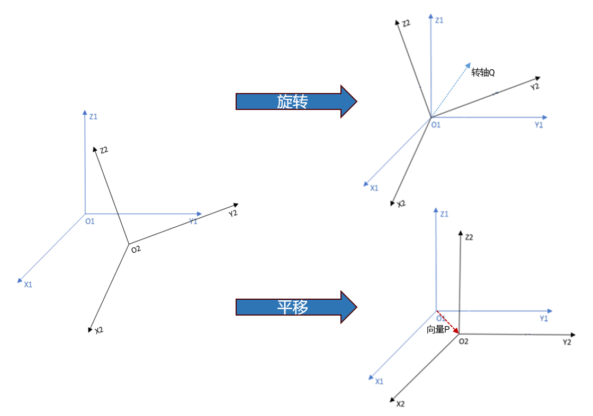
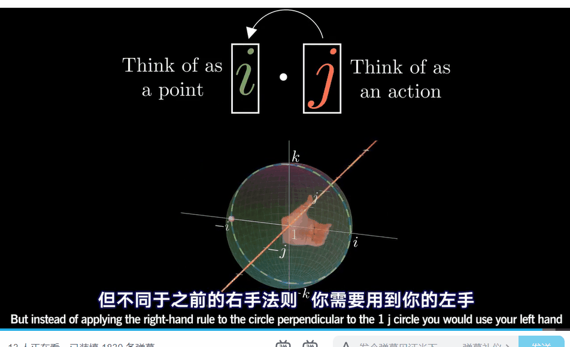

# 三维旋转

- 向量的旋转一共有三种表示方法：旋转矩阵、欧拉角和四元数

## 旋转矩阵

### 1. 引出——坐标变换

- 作用：将不同坐标系统一在同一坐标系下
- 所需数据：任意坐标系中各坐标轴在**世界坐标系**下的坐标

### 2. 位姿变换

- 位姿 = 位置 + 姿态  
  位置为特点坐标系原点相较于世界坐标系下的平移  
  姿态为该坐标系相较于世界坐标系进行的旋转
  

### 3. 旋转矩阵

- 设有一 P 点，基于坐标系$A$的坐标为$(x_a,y_a,z_a)$  
  基于坐标系$B$的坐标为$(x_b,y_b,z_b)$
- 坐标系$B$中各轴在坐标系$A$中的坐标(已单位化):
- $\begin{cases}
 X_2=\begin{bmatrix} a_x & a_y & a_z \end{bmatrix}^T\\
 Y_2=\begin{bmatrix} b_x&b_y&b_z\end{bmatrix}^T\\
 Z_2=\begin{bmatrix}c_x&c_y&c_z\end{bmatrix}^T\\
 \end{cases}
 \xrightarrow{[X\ Y\ Z]}{^A_B R}=\begin{bmatrix}
 a_x & b_x & c_x \\
 a_y & b_y & c_y \\
 a_z & b_z & c_z
\end{bmatrix}
$  
   ${^A_B R}$表示向量$P$由坐标轴$B$变换至坐标轴$A$的旋转矩阵
  其中：  
   $\begin{matrix}a_x & b_y & c_z\end{matrix}$为坐标系$B$中各个轴在坐标系$A$中$x$轴上的投影  
   $\begin{matrix}a_x & b_y & c_z\end{matrix}$为坐标系$B$中各个轴在坐标系$A$中$y$轴上的投影  
   $\begin{matrix}a_x & b_y & c_z\end{matrix}$为坐标系$B$中各个轴在坐标系$A$中$z$轴上的投影  
   **易得出**:
  ${^A_BR}\times{P_B}=\begin{bmatrix}
 a_x & b_x & c_x \\
 a_y & b_y & c_y \\
 a_z & b_z & c_z
\end{bmatrix}\times
\begin{bmatrix}
 x_b\\ y_b\\ z_b
\end{bmatrix}
=
\begin{bmatrix}
 a_xx_b+b_xy_b+c_xz_b\\ 
 a_yx_b+b_yy_b+c_yz_b\\ 
 a_zx_b+b_zy_b+c_zz_b
\end{bmatrix}
=P_A=
\begin{bmatrix}
 x_a\\ y_a\\ z_a
\end{bmatrix}
$
  $P_B$代表向量$P$在坐标系$B$中的坐标;$P_A$代表向量$P$在坐标系$A$中的坐标  
   显然：$^B_AR、^A_BR$都是单位正交矩阵，即$R^T=R^{-1}$  
   可得出：${^A_BR}={^W_BR}\times{^A_WR}={^W_BR}\times{^W_AR^{-1}}={^W_BR}\times{^W_AR^T}$

### 4. 坐标变换

坐标变换=旋转+平移，即：
$P_A={^A_BR}\times{P_B}+\overrightarrow{O_1O_2}$，$\overrightarrow{O_1O_2}$为两坐标系原点指向另一原点的向量  
改写为矩阵形式：  
$\begin{bmatrix}P_A\\1\end{bmatrix}=
\begin{bmatrix}^A_BR&\overrightarrow{O_1O_2}\\
0&1\end{bmatrix}\times
\begin{bmatrix}P_B\\1\end{bmatrix},令T=
\begin{bmatrix}^A_BR&\overrightarrow{O_1O_2}\\
0&1\end{bmatrix}\
$  
可得：${^AP}=T\times{^BP},其中T为齐次旋转矩阵$

---

## 欧拉角

### 1.定义

#### 欧拉角遵循的是右手系规则，即大拇指指向坐标轴正方向，四指旋转的方向即为转动的正方向，欧拉角包含三个自由量：yaw(偏航角)、pitch(俯仰角)、roll(翻滚角)。

- yaw: 绕物体$z$轴旋转，得到偏航角 yaw
- pitch: 绕旋转之后的$y$轴旋转，得到俯仰角 pitch
- roll: 绕旋转之后的$x$轴旋转，得到滚转角 roll

### 2.欧拉角与旋转矩阵的关系

假设绕$x,y,z$轴旋转角度依次为$\alpha,\beta,\gamma$，则旋转矩阵为:  
$\overrightarrow{R_x}=\begin{bmatrix}
1&0&0\\
0&\cos\alpha&-\sin\alpha\\
0&\sin\alpha&\cos\alpha
\end{bmatrix}$

$\overrightarrow{R_y}=\begin{bmatrix}
\cos\beta&0&-\sin\beta\\
0&1&0\\
\sin\beta&0&cos\beta
\end{bmatrix}$

$\overrightarrow{R_z}=\begin{bmatrix}
\cos\gamma&-\sin\gamma&0\\
\cos\gamma&\sin\gamma&0\\
0&0&1
\end{bmatrix}$

旋转顺序分为两种外旋(x->y->z)和内旋(z->y->x)  
当使用外旋顺序时：$\overrightarrow{P}'=\overrightarrow{R}\times\overrightarrow{P}=
(\vec{R_z}\vec{R_y} \vec{R_x})\times\vec{P}\\
=\left(
\begin{bmatrix}
\cos\gamma&-\sin\gamma&0\\
\cos\gamma&\sin\gamma&0\\
0&0&1
\end{bmatrix}
\begin{bmatrix}
\cos\beta&0&-\sin\beta\\
0&1&0\\
\sin\beta&0&\cos\beta
\end{bmatrix}
\begin{bmatrix}
1&0&0\\
0&\cos\alpha&-\sin\alpha\\
0&\sin\alpha&\cos\alpha
\end{bmatrix}
\right)
\times
\begin{bmatrix}
x\\y\\z
\end{bmatrix}\\
\\=\begin{bmatrix}
x'\\y'\\z'
\end{bmatrix}$

### 3.欧拉角的弊端

- 当任何一个坐标轴旋转角度为 90 度时,会出现"死锁"现象，即两个轴的旋转对个体起到相同的效果
- 为了解决这一问题，引出了**四元数**的概念

---

## 四元数

### 1. 四元数的定义

四元数包含了四个实参数以及三个虚部（一个实部三个虚部  
即$q=s+x\,i+y\,z+d\,k$ ，也可以看做是对基底$\{1,i,j,k\}$的线性组合

从四维角度来看，应包括三个两两垂直的虚部轴$i,j,k$(类似三维中的坐标轴)，和一个垂直于上述三轴的实数轴
因此，在实际表示中，经常将实部与虚部分开，并用三维向量来表示虚部，将其表述为标量和向量的有序对形式：  
$q=\begin{bmatrix}s&\vec{v}\end{bmatrix},其中\,\vec{v}=(\begin{matrix}x&y&z\end{matrix})\,\,,\{\begin{matrix}s&x&y&z\end{matrix}\}\subseteq\mathbb{R}$

在物理上，四元数可以描述一个物体的姿态，也可以描述一个问题的旋转

### 2. 四元数的性质

- 四元数乘法
  - **四元数乘法不满足交换律**
    | 乘法法则 | 1   | i   | j   | k   |
    | -------- | --- | --- | --- | --- |
    | 1        | 1   | i   | j   | k   |
    | i        | i   | -1  | k   | -j  |
    | j        | j   | -k  | -1  | i   |
    | k        | k   | j   | -i  | -1  |
  - 在物理上，也可以解释为何不满足交换律
    - 1. 左乘旋转四元数(左为操作动作，右为被操作对象)
         
    - 2. 右乘旋转四元数(右为操作动作，左为被操作对象)
         
- 纯四元数
    如果一个四元数可以被写成$v=\begin{bmatrix}0&\vec{u}\end{bmatrix},$ 则称$v$为一个纯四元数
- 四元数的共轭
  - 向量角度：$q=\begin{bmatrix} a \\ b \\ c \\ d \end{bmatrix}\xrightarrow{共轭}q^*\begin{bmatrix} a \\ -b \\ -c \\ -d \end{bmatrix}$
  - 复数角度：$q=\begin{bmatrix}s&\vec{u}\end{bmatrix}\xrightarrow{共轭}q^*=\begin{bmatrix}s&-\vec{u}\end{bmatrix}$
- 当四元数模值为1，则该四元数被称为单位四元数