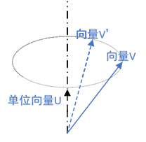
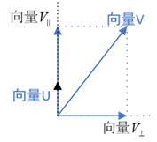
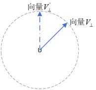
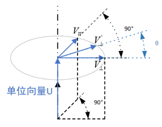

# 三维旋转

- 向量的旋转一共有三种表示方法：旋转矩阵、欧拉角和四元数

## 旋转矩阵

### 1. 引出——坐标变换

- 作用：将不同坐标系统一在同一坐标系下
- 所需数据：任意坐标系中各坐标轴在**世界坐标系**下的坐标

### 2. 位姿变换

- 位姿 = 位置 + 姿态  
  位置为特点坐标系原点相较于世界坐标系下的平移  
  姿态为该坐标系相较于世界坐标系进行的旋转
  

### 3. 旋转矩阵

- 设有一 P 点，基于坐标系$A$的坐标为$(x_a,y_a,z_a)$  
  基于坐标系$B$的坐标为$(x_b,y_b,z_b)$
- 坐标系$B$中各轴在坐标系$A$中的坐标(已单位化):
- $\begin{cases}
 X_2=\begin{bmatrix} a_x & a_y & a_z \end{bmatrix}^T\\
 Y_2=\begin{bmatrix} b_x&b_y&b_z\end{bmatrix}^T\\
 Z_2=\begin{bmatrix}c_x&c_y&c_z\end{bmatrix}^T\\
 \end{cases}
 \xrightarrow{[X\ Y\ Z]}{^A_B R}=\begin{bmatrix}
 a_x & b_x & c_x \\
 a_y & b_y & c_y \\
 a_z & b_z & c_z
\end{bmatrix}
$  
   ${^A_B R}$表示向量$P$由坐标轴$B$变换至坐标轴$A$的旋转矩阵
  其中：  
   $\begin{pmatrix}a_x & b_y & c_z\end{pmatrix}$为坐标系$B$中各个轴在坐标系$A$中$x$轴上的投影  
   $\begin{pmatrix}a_x & b_y & c_z\end{pmatrix}$为坐标系$B$中各个轴在坐标系$A$中$y$轴上的投影  
   $\begin{pmatrix}a_x & b_y & c_z\end{pmatrix}$为坐标系$B$中各个轴在坐标系$A$中$z$轴上的投影  
   **易得出**:
  ${^A_BR}\times{P_B}=\begin{bmatrix}
 a_x & b_x & c_x \\
 a_y & b_y & c_y \\
 a_z & b_z & c_z
\end{bmatrix}\times
\begin{bmatrix}
 x_b\\ y_b\\ z_b
\end{bmatrix}
=
\begin{bmatrix}
 a_xx_b+b_xy_b+c_xz_b\\ 
 a_yx_b+b_yy_b+c_yz_b\\ 
 a_zx_b+b_zy_b+c_zz_b
\end{bmatrix}
=P_A=
\begin{bmatrix}
 x_a\\ y_a\\ z_a
\end{bmatrix}
$
  $P_B$代表向量$P$在坐标系$B$中的坐标;$P_A$代表向量$P$在坐标系$A$中的坐标  
   显然：$^B_AR、^A_BR$都是单位正交矩阵，即$R^T=R^{-1}$  
   可得出：${^A_BR}={^W_BR}\times{^A_WR}={^W_BR}\times{^W_AR^{-1}}={^W_BR}\times{^W_AR^T}$

### 4. 坐标变换

坐标变换=旋转+平移，即：
$P_A={^A_BR}\times{P_B}+\overrightarrow{O_1O_2}$，$\overrightarrow{O_1O_2}$为两坐标系原点指向另一原点的向量  
改写为矩阵形式：  
$\begin{bmatrix}P_A\\1\end{bmatrix}=\begin{bmatrix}^A_BR&\overrightarrow{O_1O_2}\\0&1\end{bmatrix}\times\begin{bmatrix}P_B\\1\end{bmatrix},令T=\begin{bmatrix}^A_BR&\overrightarrow{O_1O_2}\\0&1\end{bmatrix}$ 
可得：${^AP}=T\times{^BP},\text{其中T为齐次旋转矩阵}$

---

## 欧拉角

### 1.定义

#### 欧拉角遵循的是右手系规则，即大拇指指向坐标轴正方向，四指旋转的方向即为转动的正方向，欧拉角包含三个自由量：yaw(偏航角)、pitch(俯仰角)、roll(翻滚角)。

- yaw: 绕物体$z$轴旋转，得到偏航角 yaw
- pitch: 绕旋转之后的$y$轴旋转，得到俯仰角 pitch
- roll: 绕旋转之后的$x$轴旋转，得到滚转角 roll

### 2.欧拉角与旋转矩阵的关系

假设绕$x,y,z$轴旋转角度依次为$\alpha,\beta,\gamma$，则旋转矩阵为:  
$\overrightarrow{R_x}=\begin{bmatrix}
1&0&0\\
0&\cos\alpha&-\sin\alpha\\
0&\sin\alpha&\cos\alpha
\end{bmatrix}$

$\overrightarrow{R_y}=\begin{bmatrix}
\cos\beta&0&-\sin\beta\\
0&1&0\\
\sin\beta&0&cos\beta
\end{bmatrix}$

$\overrightarrow{R_z}=\begin{bmatrix}
\cos\gamma&-\sin\gamma&0\\
\cos\gamma&\sin\gamma&0\\
0&0&1
\end{bmatrix}$

旋转顺序分为两种外旋(x->y->z)和内旋(z->y->x)  
当使用外旋顺序时：$\overrightarrow{P}'=\overrightarrow{R}\times\overrightarrow{P}=
(\vec{R_z}\vec{R_y} \vec{R_x})\times\vec{P}\\
=\left(
\begin{bmatrix}
\cos\gamma&-\sin\gamma&0\\
\cos\gamma&\sin\gamma&0\\
0&0&1
\end{bmatrix}
\begin{bmatrix}
\cos\beta&0&-\sin\beta\\
0&1&0\\
\sin\beta&0&\cos\beta
\end{bmatrix}
\begin{bmatrix}
1&0&0\\
0&\cos\alpha&-\sin\alpha\\
0&\sin\alpha&\cos\alpha
\end{bmatrix}
\right)
\times
\begin{bmatrix}
x\\y\\z
\end{bmatrix}\\
\\=\begin{bmatrix}
x'\\y'\\z'
\end{bmatrix}$

### 3.欧拉角的弊端

- 当任何一个坐标轴旋转角度为 90 度时,会出现"死锁"现象，即两个轴的旋转对个体起到相同的效果
- 为了解决这一问题，引出了**四元数**的概念

---

## 四元数

### 1. 四元数的定义

四元数包含了四个实参数以及三个虚部（一个实部三个虚部  
即$q=s+x\,i+y\,z+d\,k$ ，也可以看做是对基底$\{1,i,j,k\}$的线性组合

从四维角度来看，应包括三个两两垂直的虚部轴$i,j,k$(类似三维中的坐标轴)，和一个垂直于上述三轴的实数轴
因此，在实际表示中，经常将实部与虚部分开，并用三维向量来表示虚部，将其表述为标量和向量的有序对形式：  
$q=\begin{bmatrix}s&\vec{v}\end{bmatrix},其中\,\vec{v}=(\begin{matrix}x&y&z\end{matrix})\,\,,\{\begin{matrix}s&x&y&z\end{matrix}\}\subseteq\mathbb{R}$

在物理上，四元数可以描述一个物体的姿态，也可以描述一个问题的旋转

### 2. 四元数的性质

- 四元数乘法
  - 四元数乘法推导  
    $设q_1=a+bi+cj+dk\qquad q_2=e+fi+gj+hk\\
    \begin{aligned}
    \qquad q_1q_2&=(a+bi+cj+dk)(e+fi+gj+hk)\\
    &=(ae-bf-cg-dh)+(be+af+ch-dg)i+\\
    &\,\,\quad(ce+ag+df-bh)j+(de+ah+bg+-cf)k\\
    \xrightarrow{表示为矩阵形式}&=
    \begin{bmatrix}
    a&-b&-c&-d\\
    b&a&-d&c\\
    c&d&a&-b\\
    d&-c&b&a
    \end{bmatrix}
    \begin{bmatrix}
    e\\f\\g\\h
    \end{bmatrix}
    \end{aligned}\\
    同理可得q_2q_1=\begin{bmatrix}
    a&-b&-c&-d\\
    b&a&d&-c\\
    c&-d&a&b\\ 
    d&c&-b&a
    \end{bmatrix}
    \begin{bmatrix}
    e\\f\\g\\h
    \end{bmatrix}
    $ 
  - **四元数乘法不满足交换律**
    | 乘法法则 | 1   | i   | j   | k   |
    | -------- | --- | --- | --- | --- |
    | 1        | 1   | i   | j   | k   |
    | i        | i   | -1  | k   | -j  |
    | j        | j   | -k  | -1  | i   |
    | k        | k   | j   | -i  | -1  |
  - 在物理上，也可以解释为何不满足交换律
    - 1. 左乘旋转四元数(左为操作动作，右为被操作对象)
         
    - 2. 右乘旋转四元数(右为操作动作，左为被操作对象)
         
- 纯四元数
  如果一个四元数可以被写成$v=\begin{bmatrix}0&\vec{u}\end{bmatrix},$ 则称$v$为一个纯四元数
- 四元数的共轭
  - 向量角度：$q=\begin{bmatrix} a \\ b \\ c \\ d \end{bmatrix}\xrightarrow{共轭}q^*\begin{bmatrix} a \\ -b \\ -c \\ -d \end{bmatrix}$
  - 复数角度：$q=\begin{bmatrix}s&\vec{u}\end{bmatrix}\xrightarrow{共轭}q^*=\begin{bmatrix}s&-\vec{u}\end{bmatrix}$
- 当四元数模值为 1，则该四元数被称为单位四元数

### 3.四元数与三维旋转

#### 三维旋转

- 向量 V 绕向量 U 进行三维空间内的旋转得到向量 V',其中向量 U 为单位向量
- 分解以简化旋转操作
  - 将向量 V 分为垂直向量 U 和平行向量 U 两部分：  
    
  - 向量$V_\parallel$不参与旋转，参与旋转的是$V_\perp$：  
    
  - 因此只需要得到向量$V_\perp'$就可以表达出整个旋转过程  
    
  - 设向量$V_\perp$和$V_\perp'$之间夹角为$\theta\,$,可得出：  
    $\overrightarrow{V}'=\overrightarrow{V}_\parallel'+\overrightarrow{V}_\perp'=\overrightarrow{V}_\parallel+((\cos\theta) \overrightarrow{V}_\perp+(\sin\theta) \overrightarrow{V}_W)=\overrightarrow{V}_\parallel+((\cos\theta) \overrightarrow{V}_\perp+(\sin\theta) \overrightarrow{U} \times \overrightarrow{V})$

#### 三维旋转转四元数

- 将向量$\overrightarrow{U}$和$\overrightarrow{V}_\perp'$用四元数表示：  
  $U=\begin{bmatrix}0&\overrightarrow{U}\end{bmatrix}\,\,\,\,V_\perp'=\begin{bmatrix}0&\overrightarrow{V}_\perp'\end{bmatrix}$
- $$
  因为\left.
  \begin{aligned}
  &UV=\begin{bmatrix}0&\overrightarrow{U}\end{bmatrix}\begin{bmatrix}0&\overrightarrow{V}\end{bmatrix}=\begin{bmatrix}-\overrightarrow{U}\cdot\overrightarrow{V}_\perp'&\overrightarrow{U}\times\overrightarrow{V}_\perp'\end{bmatrix}\\
  &V_\perp'=\sin\theta(\overrightarrow{U}\times\overrightarrow{V}_\perp')且\overrightarrow{U}\cdot\overrightarrow{V}_\perp'=0
  \end{aligned}
  \right\} V_\perp'=(\sin\theta)UV
  $$
- 三维旋转转化四元数
  $$
  \begin{aligned}
  V'&=\overrightarrow{V}_\parallel+((\cos\theta) \overrightarrow{V}_\perp+(\sin\theta) \overrightarrow{U} \times \overrightarrow{V})\\
  &=\overrightarrow{V}_\parallel+((\cos\theta)\begin{bmatrix}0&\overrightarrow{V}_\perp'\end{bmatrix}+(\sin\theta)UV_\perp')\\
  &=\overrightarrow{V}_\parallel+((\cos\theta)+(\sin\theta)U)V_\perp'\\
  &\xrightarrow{\text{令}q=[\cos\theta\,\,\sin\theta U]}\overrightarrow{V}_\parallel+qV_\perp'
  \end{aligned}
  $$
- 给出两条定理：
  - 1. 假设$v_\parallel=\begin{bmatrix}0&\vec{v}_\parallel\end{bmatrix}$是一个纯四元数，而$q=\begin{bmatrix}\alpha&\beta \vec{u}\end{bmatrix}\,$，其中$\vec{u}$是一个单位向量，$\alpha\,,\,\beta\in\mathbb{R}$，在这种条件下，如果$\vec{v}_\parallel$平行于$\vec{u}$，那么$qv_\parallel=v_\parallel q$(两平行向量绕对方旋转无变化)
  - 2. 假设$v_\perp=\begin{bmatrix}0&\vec{v}_\perp\end{bmatrix}$是一个纯四元数，而$q=\begin{bmatrix}\alpha&\beta \vec{u}\end{bmatrix}\,$，其中$\vec{u}$是一个单位向量，$\alpha\,,\,\beta\in\mathbb{R}$，在这种条件下，如果$\vec{v}_\perp$正交于$\vec{u}$，那么$qv_\perp=v_\perp q^*$
- 根据定理对上一步式子进行进一步变换
 
  $$
  \begin{aligned}
  V'&=\overrightarrow{V}_\parallel+qV_\perp'\xrightarrow{\text{设}q=1=p^2}1\times\overrightarrow{V}_\parallel+p^2V_\perp'=pp^{-1}\times\overrightarrow{V}_\parallel+p^2V_\perp'\\
  &=pp^{-1}\times\begin{bmatrix}0&\overrightarrow{V}_\parallel'\end{bmatrix}+p^2V_\perp'=pp^{-1}\times V_\parallel'+p^2V_\perp'\\
  &=p(V_\parallel'+V_\perp)p^*=pV'p^{-1}
  \end{aligned}
  $$

  $$
  \begin{aligned}
  \because
  q^2&=\begin{bmatrix}\cos\theta&\sin\theta\,\vec{u}\end{bmatrix}^2=(\cos\theta+\sin\theta\,\vec{u})(\cos\theta+\sin\theta\,\vec{u})\\
  &=\cos^2\theta-\sin^2\theta+2\sin\theta\cos\theta\,\vec{u}\\
  &=\cos2\theta+\sin2\theta\,\vec{u}=\begin{bmatrix}\cos2\theta&\sin2\theta\,\vec{u}\end{bmatrix}\\
  \therefore
  p&=\sqrt{q}=\begin{bmatrix}\cos\displaystyle \frac{\theta}{2}&(\cos\displaystyle \frac{\theta}{2})\,\vec{u}\end{bmatrix}
  \end{aligned}
  $$

#### 四元数转旋转矩阵
- 通过上文推导出的[四元数乘法的矩阵形式](#target)可以实现四元数向旋转矩阵的转换
$$
\begin{aligned}
V' &= qVq^* = L(q)R(q^*)V \qquad \qquad \text{(L(q)代表左乘矩阵，R(q)代表右乘矩阵)}\\
&= \begin{bmatrix}
    a & -b & -c & -d \\
    b & a & -d & c \\
    c & d & a & -b \\
    d & -c & b & a
  \end{bmatrix}
  \begin{bmatrix}
    a & b & c & d \\
    -b & a & -d & c \\
    -c & d & a & -b \\
    -d & -c & b & a
  \end{bmatrix} V\\
&= \begin{bmatrix}
  a^2+b^2+c^2+d^2 & ab-ab-cd+cd & ac+bd-ac-bd & ad-bc+bc-ad \\
  ab-ab+cd-cd & b^2+a^2-d^2-c^2 & bc-ad-ad+bc & bd+ac+bd+ac \\
  ac-bd-ac+bd & bc+ad+ad+bc & c^2-d^2+a^2-b^2 & cd+cd-ab-ab \\
  ad+bc-bc-ad & bd-ac+bd-ac & cd+cd+ab+ab & d^2-c^2-b^2+a^2
  \end{bmatrix} V \\
&= \begin{bmatrix}
  1 & 0 & 0 & 0 \\
  0 & 1-2c^2-2d^2 & 2bc-2ad & 2ac+2bd \\
  0 & 2bc+2ad & 1-2b^2-2d^2 & 2cd-2ab \\
  0 & 2bd-2ac & 2cd+2ab & 1-2b^{2}-2c^{2}
  \end{bmatrix} V
\end{aligned}
$$

#### 四元数与欧拉角的转化  

$$
q=\begin{bmatrix}
  s\\x\\y\\z
\end{bmatrix}
=\begin{bmatrix}
  \cos \frac{\varphi}{2}\cos \frac{\theta}{2}\cos \frac{\psi}{2} + \sin \frac{\varphi}{2}\sin \frac{\theta}{2}\sin \frac{\psi}{2}\\
  \cos \frac{\varphi}{2}\sin \frac{\theta}{2}\cos \frac{\psi}{2} + \sin \frac{\varphi}{2}\cos \frac{\theta}{2}\sin \frac{\psi}{2}\\
  \cos \frac{\varphi}{2}\cos \frac{\theta}{2}\sin  \frac{\psi}{2} - \sin \frac{\varphi}{2}\sin \frac{\theta}{2}\cos \frac{\psi}{2}\\
  \sin \frac{\varphi}{2}\cos \frac{\theta}{2}\cos \frac{\psi}{2} - \cos \frac{\varphi}{2}\sin \frac{\theta}{2}\sin \frac{\psi}{2}
\end{bmatrix}
$$

$$
  \begin{bmatrix}
    \varphi\\
    \theta\\
    \psi
  \end{bmatrix}
  =\begin{bmatrix}
    \arctan(\displaystyle \frac{2(sz+xy)}{1-2(z^2+x^2)})\\
    \arcsin(2(sz-yz))\\
    \arctan(\displaystyle \frac{2(sy+zx)}{1-2(x^2+y^2)})
  \end{bmatrix},
  \text{其中：}
  \begin{cases}
    \varphi \text{为绕x轴旋转角度，即滚转角roll}\\
    \theta \text{为绕y轴旋转角度，即俯仰角pitch}\\
    \psi \text{为绕z轴旋转角度，即偏航角yaw}
  \end{cases}
%Latex矩阵能不换行不换行，能不空格不空格
$$

在程序中可以使用atan2函数。该函数有两个参数，分别为所求点的x值和y值，返回值是角度值，上述式子中，分子为参数1，分母为参数2

